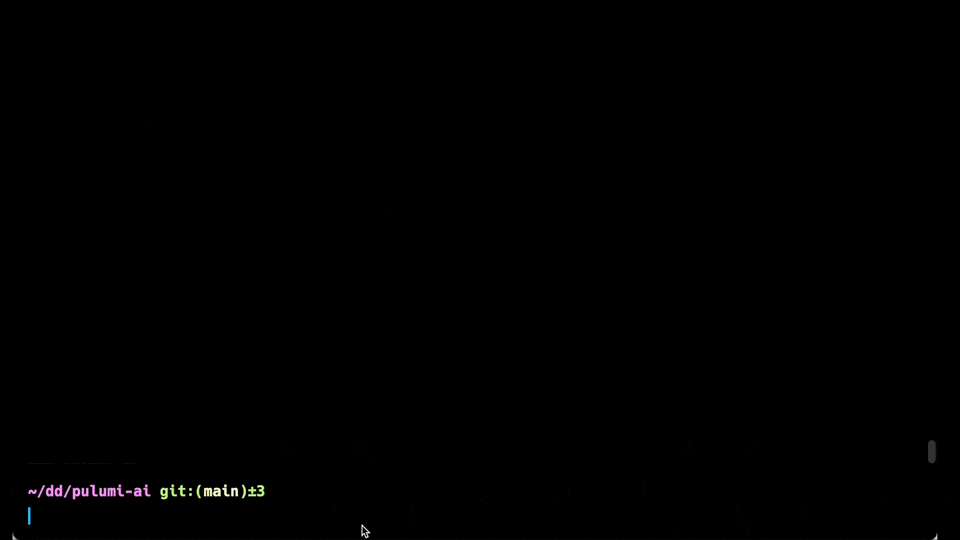

# Pulumi AI

Create cloud infrastructure with Pulumi Automation API ☁️ and OpenAI GPT 🤖.



```
> npx pulumi-ai

Welcome to Pulumi AI.

Your stack: https://app.pulumi.com/luke/pulumi-ai/dev/resources

What cloud infrastructure do you want to build today?

> An AWS VPC
create aws:ec2/vpc:Vpc my-vpc ...
created my-vpc
vpcCidrBlock: 10.0.0.0/16
vpcId: vpc-016f35c7f078ab9e8

> Add three private subnets
create aws:ec2/subnet:Subnet private-subnet-2-2 ...
create aws:ec2/subnet:Subnet private-subnet-1-1 ...
create aws:ec2/subnet:Subnet private-subnet-3-3 ...
created private-subnet-2-2
created private-subnet-3-3
created private-subnet-1-1
privateSubnetIds: subnet-08add1c8ae97e3cfb,subnet-0cb4ea675f7ac64fe,subnet-0f9a22c87e766fa17
vpcId: vpc-016f35c7f078ab9e8

> Remove one of the subnets
delete aws:ec2/subnet:Subnet private-subnet-3-3 ...
deleted private-subnet-3-3
privateSubnetIds: subnet-08add1c8ae97e3cfb,subnet-0cb4ea675f7ac64fe
vpcId: vpc-016f35c7f078ab9e8

>
```